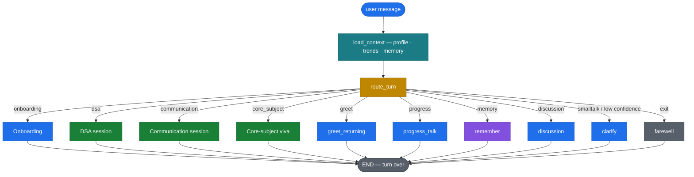
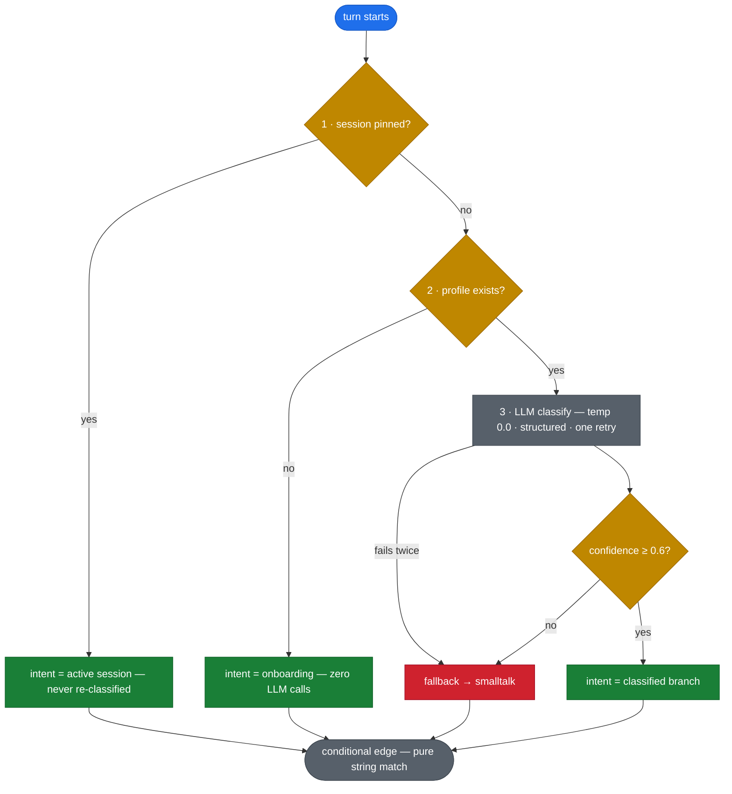
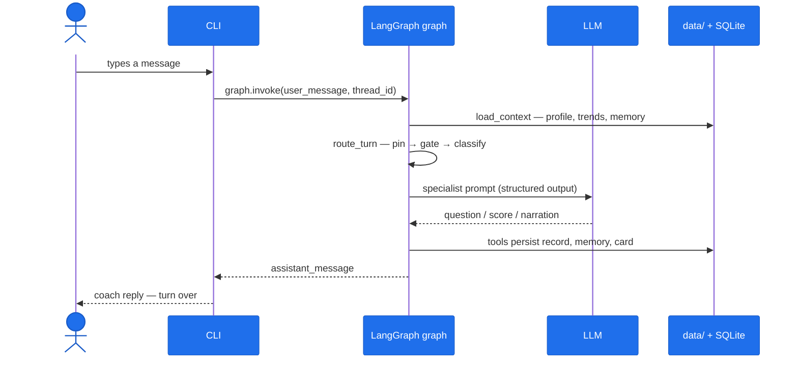
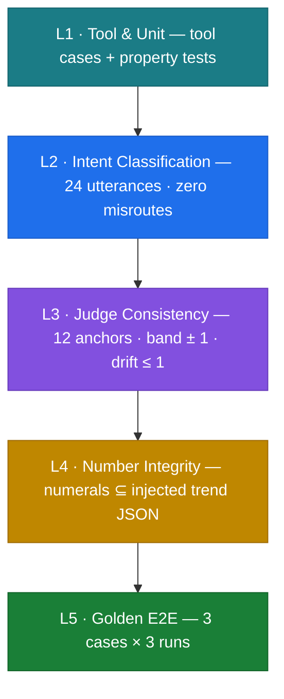
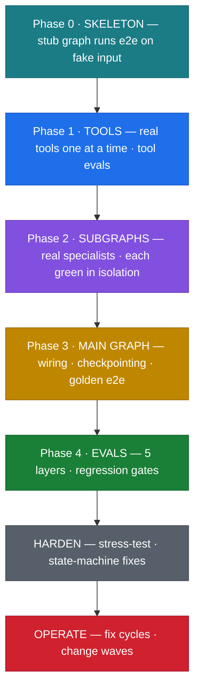

<div align="center">

# 🎓 placement-prep-agent

**A turn-based interview-prep coach that drills you like a real interviewer —
DSA problems, behavioral communication, and core-subject vivas — on a
persistent report card.**

LangGraph 1 · one graph, three specialist subgraphs, versioned tools
· CLI, LangGraph Studio, or OpenAI-compatible API


</div>

---

`placement-prep-agent` is a coach you talk to from your terminal. It runs
**onboarding** once, then routes every message into one of three specialist
sessions — **DSA problem drills**, a **communication interview**, or a
**core-subject viva** — scoring answers with rubric-based LLM judges and
appending every session to a local report card. The repo also ships the
[skill library](#-the-skill-library-behind-it) and manual (`AGENTS.md`) used
to build it — see [How this agent was built](#%EF%B8%8F-how-this-agent-was-built-the-workflow-behind-it).

## ✨ Highlights

| | |
|---|---|
| 🎯 **Three specialist sessions** | DSA drills · communication interview · core-subject viva |
| 🧮 **Deterministic DSA practice** | 100-question bank, reasoning-based selection, no repeats |
| 📖 **Any core subject** | curated AIML/cyber syllabi; anything else generated + cached |
| 🧠 **Cross-session memory** | profile, durable facts, per-field trends survive restarts |
| 🛡️ **Hardened · eval-gated** | session pinning · 191 tests · mypy --strict · 5 live eval layers, all green |

## 📑 Contents

- [Architecture](#️-architecture) — main graph, routing, specialists
- [Runtime workflow](#-runtime-workflow--one-turn-end-to-end) — one message, end to end
- [Memory & persistence](#-memory--persistence)
- [Quality: tests & the 5-layer eval suite](#-quality-tests--the-5-layer-eval-suite)
- [How this agent was built](#%EF%B8%8F-how-this-agent-was-built-the-workflow-behind-it) · [Skill library](#-the-skill-library-behind-it)
- [Repo layout](#-repo-layout) · [Quickstart](#-quickstart)

## 🏗️ Architecture

One LangGraph `StateGraph` (`src/prep_agent/graph.py`) owns the runtime. Every
message is **one invocation**: `load_context` hydrates state, `route_turn`
decides the owner, one of **ten handlers** replies, `END`. Specialists are
compiled subgraphs nested inside.



**Routing — three gates, then a pure string match.** `route_turn` normalizes
everything inside the node; the conditional edge never sees raw classifier output.



### The three specialists

| | 🧮 DSA session | 💬 Communication session | 📚 Core-subject viva |
|---|---|---|---|
| **Format** | 1 problem, ≤ 3 attempts, optimality 0-100 | 8-10 behavioral questions, scored 0-10 | 8-10 viva questions, core + DSA-theory tracks |
| **Source** | Shipped 100-question bank (easy → hard by id) | Fixed question kinds per position | Curated (AIML/cyber) or generated + cached syllabus |
| **Judge** | Grades vs the bank's ground truth | `COMM_JUDGE_V1` rubric, temp 0.2 | `CORE_JUDGE_V1` rubric, temp 0.2 |
| **Wrap** | Mints record · reveals reference approach | Record + coach summary | Record + weakest-topic recap |

**DSA selection is pure Python — no LLM in the loop:** tier frontier from the
last score, least-covered topics first, weak-area pool filter, lowest unsolved
id in tier. Solved questions **never return**; half-solved ones come back first
with a one-line note (*"last time you reached brute force at 55/100 — push for
the optimal approach now"*). You only ever see **"Question id"**; one retry-then-wrap
loop ends each session with the reference approach revealed.

## 🔁 Runtime workflow — one turn, end to end

The CLI is a thin REPL: print the reply, read the next line, invoke again.
Every durable effect goes through idempotent tools with `ToolError` contracts —
nodes never touch the filesystem directly.



The SQLite checkpointer gives every thread resumable state — a mid-session
`Ctrl-C` resumes instead of restarting.

## 🧠 Memory & persistence

All durable state lives under gitignored `data/` — the code is stateless; the
files are the memory.

| File | Written by | Purpose |
|---|---|---|
| `data/profile.json` | `write_profile` | The 6 onboarding fields |
| `data/report_card.json` | `init / save_session_results` | Per-field aggregates + trend verdicts |
| `data/history/*.json` | `save_session_results` | Full `SessionRecord` per session (idempotency key) |
| `data/memory.json` | `remember` node | Durable facts + basics digest |
| `data/checkpoints.sqlite` | `SqliteSaver` | Per-thread checkpoints |

Safety properties: **trends are computed in Python** (never trust an LLM with
arithmetic); **memory reset is CLI-only** (`python -m prep_agent reset-memory`)
so no prompt can wipe it; **every write is atomic and idempotent** with visible
failure via `ToolError`.

## ✅ Quality: tests & the 5-layer eval suite

Static gates: `ruff` + `mypy --strict src`, both clean; `pytest` runs 191
hermetic tests (~4s). On top sits a live suite (`python -m evals.run --layer
all`) with a hard gate per layer:



Final GREEN evidence: [`evals/results/`](evals/results/README.md) — L1 106/106 ·
L2 24/24 · L3 12/12 · L4 16/16 · L5 9/9. Red runs are **never re-rolled** — fix
the code, re-run the gate. A 146-turn, 4-persona adversarial stress-test
(normal · rude · chaotic · weird) added zero user-visible crashes.

## 🛠️ How this agent was built — the workflow behind it

This agent was produced by the gate-driven pipeline in [`AGENTS.md`](AGENTS.md):
design top-down, build bottom-up, test before push. Every session builds
exactly one feature:


> **Iron rule:** nothing is pushed until every test is green — never commented
> out, never weakened. Design happens on paper first; construction climbs from
> tools to the main graph with a **gate at every rung**:



| Phase | What shipped | Gate evidence |
|---|---|---|
| **0** Bootstrap + skeleton | Skill library · stub main graph + 3 stub subgraphs | runs e2e on scripted turns |
| **1** Tools | `write-profile` · `init-report-card` · `save-session-results` · `render-report-card` | 17/17 tool cases + 6/6 properties |
| **2** Specialists | Real onboarding / comm / dsa / core per approved contracts | each subgraph green in isolation |
| **3** Main graph | Wiring, SQLite checkpointing, HTML report card | golden e2e green |
| **4** Evals | 5-layer suite live; bugs B-1..B-8 fixed | **all 5 gates GREEN** |
| **Change 1-3** | Open core subject · 100-question DSA bank · memory | regression pins + gates re-run |
| **Fix cycles** | Discussion intent · clarify cap · coach persona | 191 tests · ruff · mypy --strict |

## 🧰 The skill library behind it

`skills/` ships **12 skill packages** distilled from a 599-page multi-agent
masterclass — the same library that governed this build. Lean `SKILL.md` +
on-demand `references/` with runnable templates.

| Stage | Skills |
|---|---|
| **GOVERNING** — every session | `planning-and-task-breakdown` · `ponytail` |
| **DESIGN + BUILD** | `agent-architecture-advisor` · `langgraph-builder` · `agent-tool-designer` · `multi-agent-builder` · `hitl-builder` · `agent-memory-builder` |
| **HARDEN** | `agent-reliability-hardener` · `agent-guardrails-builder` · `agent-eval-builder` |
| **OPERATE** | `agent-debugger` |

To reuse the workflow for a new agent: read `AGENTS.md`, run its Intake
procedure, let the ladder drive construction — this repo is the worked example.

## 📁 Repo layout

```
placement-prep-agent/
├── AGENTS.md                    ← operating manual: pipeline, Build Ladder, gates
├── context/                     ← project truth files: graph-design · registries · eval-plan · progress-tracker
├── src/prep_agent/              ← the agent (LangGraph)
│   ├── graph.py                 ←   root graph — 12 nodes, 1 conditional edge
│   ├── state.py                 ←   MainState + pydantic models
│   ├── nodes/ · subgraphs/      ←   handlers + dsa/comm/core specialists
│   ├── prompts/ · tools/        ←   version-pinned prompts · idempotent tools
│   └── data/dsa_bank.json       ←   the 100-question DSA bank
├── evals/                       ← 5-layer eval suite + GREEN gate evidence
├── tests/                       ← unit / subgraph / e2e — 191 hermetic tests
├── skills/                      ← 12 skill packages (2 governing + 10 stage)
├── langgraph.json               ← `langgraph dev` (Studio) entrypoint
└── pyproject.toml               ← pinned deps · ruff · mypy --strict · pytest
```

## 🚀 Quickstart

```bash
git clone https://github.com/shanmukhanssm/placement-prep-agent
cd placement-prep-agent
python -m venv .venv && source .venv/bin/activate
pip install -e ".[dev]"
cp .env.example .env          # fill in LLM_API_KEY (any OpenAI-compatible provider)
python -m prep_agent          # start coaching — onboarding greets you first
```

| Command | What it does |
|---|---|
| `python -m prep_agent` | chat with the coach — Textual TUI (chat pane + live sidebar; ^Q quit · ^R report · ^M memory · ^L clear); resumes the last thread |
| `python -m prep_agent --new` | start a fresh conversation thread (re-points the resume file) |
| `python -m prep_agent --plain` | legacy print REPL (resumes / `--new` works the same) |
| `python -m prep_agent reset-memory` | wipe memory (CLI-only by design) |
| `pytest` · `ruff check src tests` · `mypy --strict src` | all gates, no network |
| `python -m evals.run --layer all` | live 5-layer eval suite (needs `.env`) |
| `langgraph dev` | open the graph in LangGraph Studio |

## 🤝 Contributing

PRs welcome — every change must keep `pytest`, `ruff`, and `mypy --strict`
green; Conventional Commits (`feat(dsa): …`) keep history scannable.

## 📄 License

[MIT](LICENSE) © 2026 shanmukhanssm

