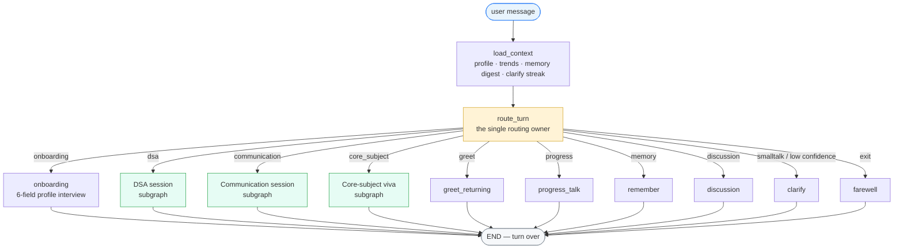
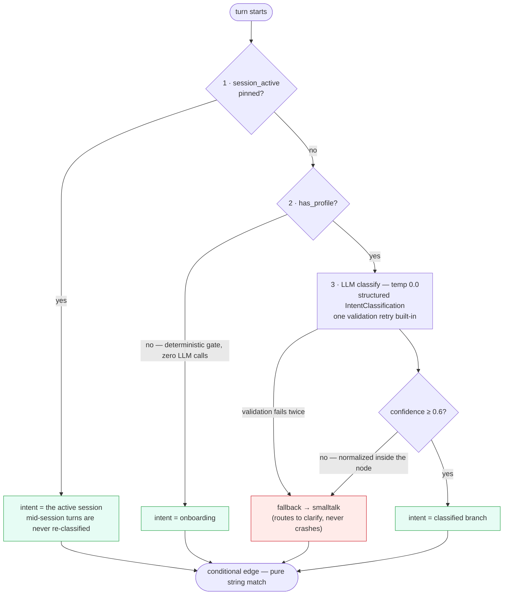
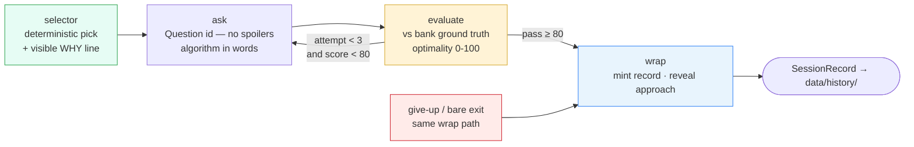
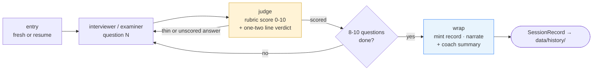
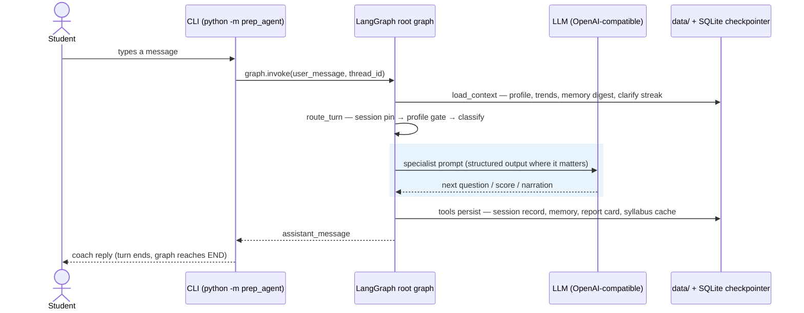
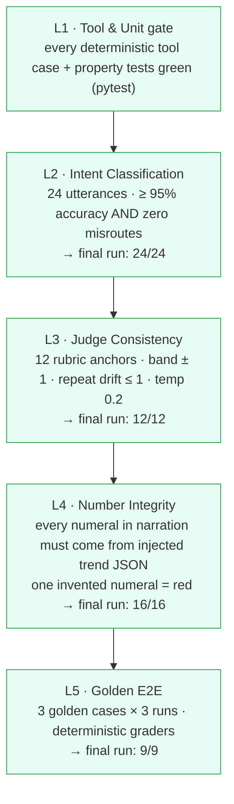
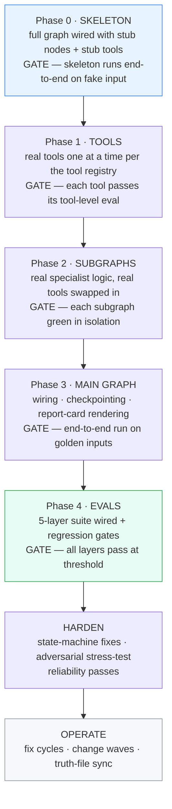

<div align="center">

# 🎓 placement-prep-agent

**A turn-based interview-prep coach that drills you like a real interviewer —
DSA problems, behavioral communication, and core-subject vivas — and tracks your
progress on a persistent report card.**

Built on **LangGraph 1** · Single graph, three specialist subgraphs, real tools
· Runs as a CLI, in **LangGraph Studio**, or as an OpenAI-compatible API server


</div>

---

`placement-prep-agent` is a coach you talk to from your terminal. One conversation
turn at a time it runs **onboarding**, then routes every message into one of three
specialist sessions — **DSA problem-solving**, **interview communication**, or a
**core-subject viva** — scoring your answers with rubric-based LLM judges and
appending every session to a local report card. Trends are computed in Python
(never by the LLM), so the numbers you see are the numbers on disk.

It is also the reference application of a disciplined agent-building workflow:
this repo ships the [12-skill library](#-the-skill-library-behind-it) and the
operating manual (`AGENTS.md`) that were used to design, build, test, and harden
the agent itself — see [How this agent was built](#%EF%B8%8F-how-this-agent-was-built-the-workflow-behind-it).

## ✨ Highlights

| | |
|---|---|
| 🎯 **Three specialist sessions** | DSA problem drills · behavioral communication interview · core-subject viva |
| 🧮 **Deterministic DSA practice** | 100-question bank with reasoning-based selection — solved questions never return, half-solved ones come back first |
| 📖 **Any core subject** | AIML & cybersecurity ship curated syllabi; anything else gets a generated, cached syllabus |
| 🧠 **Cross-session memory** | Profile, durable facts ("remember I prefer Python"), and per-field score trends survive restarts |
| 📊 **Persistent report card** | Every session appended to `data/`, trends computed in Python, rendered to a standalone HTML card |
| 🛡️ **Hardened by design** | Session pinning, confidence floor, structured-output retries, clarify-escalation cap, give-up handling |
| ✅ **Eval-gated** | 191 hermetic tests, `ruff` + `mypy --strict` clean, and a live 5-layer eval suite — all gates green |

## 📑 Contents

- [Architecture](#-architecture) — the main graph, routing, and the three specialists
- [Runtime workflow](#-runtime-workflow-one-turn-end-to-end) — what happens on every message
- [Memory & persistence](#-memory--persistence) — what survives a restart
- [Quality: tests & the 5-layer eval suite](#-quality-tests--the-5-layer-eval-suite)
- [How this agent was built](#%EF%B8%8F-how-this-agent-was-built-the-workflow-behind-it) — the workflow *behind* the agent
- [The skill library behind it](#-the-skill-library-behind-it)
- [Repo layout](#-repo-layout)
- [Quickstart](#-quickstart)

## 🏗️ Architecture

A single LangGraph `StateGraph` (`src/prep_agent/graph.py`) owns the whole runtime.
Every user message is **one graph invocation**: `load_context` hydrates the state,
`route_turn` decides who owns the turn, one of **ten handlers** produces the reply,
and the graph reaches `END` — turn over, awaiting the next message. Specialist
sessions are compiled subgraphs nested inside the root graph.



### Routing: three gates, then a pure string match

`route_turn` is the **only** node that decides intent — and it never lets the
conditional edge see raw classifier output. The edge itself is a pure string match
on `state.intent`; all normalization happens inside the node.



### The three specialists

Each specialist is a compiled subgraph with its own typed state (`subgraphs/state.py`),
its own phase machine, and its own rubric judge. They share the root `MainState`
through a deliberately narrow, dict-based boundary (`session_data`).

| | 🧮 DSA session | 💬 Communication session | 📚 Core-subject viva |
|---|---|---|---|
| **Format** | One problem, up to 3 attempts, scored 0-100 on optimality | 8-10 behavioral/interview questions, scored 0-10 | 8-10 viva questions mixing core theory + DSA-theory tracks |
| **Question source** | Shipped **100-question bank** (ids 1-30 easy · 31-70 medium · 71-100 hard) | Fixed question kinds per position | Curated syllabus (AIML / cyber) or generated + cached syllabus for any subject |
| **Selection** | **Deterministic, reasoning-based** — see below | Question-kind ladder | Weakest-topic-first + weak-area matching |
| **Judge** | `DSA_EVALUATOR_V1` grades against the bank's ground truth (approach + edge cases ride with the question, never through the LLM) | `COMM_JUDGE_V1` rubric, temp 0.2 | `CORE_JUDGE_V1` rubric, temp 0.2 |
| **Wrap** | Mints a record, reveals the reference approach | Mints record + coach-style summary | Mints record + weakest-topic recap |

**DSA selection is pure Python — no LLM in the loop:**

1. **Tier frontier** — last session's score decides the tier: pass steps up, < 50 steps down, else hold.
2. **Topic diversity** — least-covered topics first; topics from the last two DSA sessions are excluded.
3. **Weak-area pool** — self-declared weak areas filter the topic pool first.
4. **Difficulty frontier** — lowest unsolved id within the chosen topic's tier.

Solved questions (pass-terminated) are **never served again** — across any number
of sessions. Non-pass questions come back **first**, announced with a one-line note
derived from the stored verdict (*"last time you reached brute force at 55/100 —
push for the optimal approach now"*). The history file **is** the store: no extra
state file is needed to track completion.

The student only ever sees **"Question {id}"** — titles, topics, and difficulty
labels stay internal by design (numbers only, no spoilers).



Communication and core-subject sessions share a simpler interviewer → judge loop:



## 🔁 Runtime workflow — one turn, end to end

The CLI is a thin REPL around the graph: print `assistant_message`, read the next
line, invoke again. Every durable effect goes through versioned tools with
`ToolError` error contracts — nodes never touch the filesystem directly.



The SQLite checkpointer (`data/checkpoints.sqlite`) gives every chat thread its own
checkpointed state, so a mid-session `Ctrl-C` resumes where you left off instead of
restarting the session.

## 🧠 Memory & persistence

All durable state lives under gitignored `data/` — the agent's code is stateless;
the files are the memory.

| File | Written by | Purpose |
|---|---|---|
| `data/profile.json` | `write_profile` | The 6 onboarding fields (name, branch, grad year, roles, weak areas, core subject) |
| `data/report_card.json` | `init_report_card` / `save_session_results` | Per-field score aggregates + recomputed trend verdicts |
| `data/history/{date}-{field}-{n}.json` | `save_session_results` | Full `SessionRecord` per session (idempotency key = record id) |
| `data/memory.json` | `remember` node | Durable facts the student shares ("remember I prefer Python") + basics digest |
| `data/syllabus/{slug}.json` | `ensure_syllabus` | One-time generated syllabus for non-curated subjects |
| `data/checkpoints.sqlite` | LangGraph `SqliteSaver` | Per-thread conversation checkpoints |
| `REPORT_CARD.html` | `render_report_card` | Standalone HTML card with score badges and trend colors |

Three deliberate safety properties:

- **Trends are computed in Python** (`progress_math.compute_trend`), never by an
  LLM — an LLM is never trusted with arithmetic.
- **Memory reset lives outside the graph**: `python -m prep_agent reset-memory`
  is the *only* reset path. No node, prompt, or in-chat request can wipe memory.
- **Every write is idempotent and atomic** (temp-file + rename, retry-with-backoff),
  with `ToolError` contracts so a failed save degrades visibly instead of silently.

## ✅ Quality: tests & the 5-layer eval suite

The repo's own rule: **nothing ships until every gate is green.** Static gates are
`ruff check src tests` and `mypy --strict src` (both clean); `pytest` runs 191
hermetic tests (unit + subgraph + end-to-end — no network, ~4s).

On top of the test suite sits a live **5-layer eval suite** (`evals/`, run with
`python -m evals.run --layer all`). Each layer has a hard gate; a red layer stops
the pipeline.



Final green evidence for every layer is kept in [`evals/results/`](evals/results/README.md).
The suite caught real bugs during development — e.g. Layer 4 flagged hallucinated
numerals in trend narration, and Layer 5 caught them again post-fix — and the red
runs were **never re-rolled**: fix the code, re-run the gate.

Robustness beyond the eval suite: a **146-turn, 4-persona adversarial stress-test**
(normal · rude · chaotic · weird) ran the real state machine against a rate-limited
LLM shim — zero user-visible crashes, all transport failures absorbed by retries,
and the findings fed the post-4.2 fix cycle.

## 🛠️ How this agent was built — the workflow behind it

This agent was not hand-rolled end to end and then patched. It was produced by a
disciplined, gate-driven build pipeline documented in **[`AGENTS.md`](AGENTS.md)** —
an operating manual that treats agent construction like production software
engineering: design top-down, build bottom-up, test before push, record everything.

### The session pipeline

Every build session (human + coding agent working together) executes the same loop
for exactly one feature:

```mermaid
flowchart LR
    A["INPUT<br/>repo + one task"] --> B["ACQUIRE<br/>clone / fetch"]
    B --> C["ORIENT<br/>read context in order"]
    C --> D["PLAN<br/>one feature · one primary skill"]
    D --> E["BUILD<br/>the Build Ladder ↓"]
    E --> F["TEST<br/>full suite, not just happy path"]
    F --> G["VERIFY<br/>phase eval gate"]
    G --> H["RECORD<br/>living files updated"]
    H --> I["SHIP<br/>commit + push"]
    F -. "red test stops the pipeline" .-> E
    style I fill:#e6fcf4,stroke:#2da44e
    style F fill:#fff3d6,stroke:#d4a72c
```



> **The iron rule:** nothing is pushed until the full test suite is green.
> Build → test → push. Never any other order. A red test stops the pipeline —
> never comment it out, never weaken the assertion.

### The Build Ladder

Design happens on paper first (`graph-design.md` declared the full topology, state
schema, and node specs before any real code), then construction climbs from the
leaves — tools — to the root — the main graph — with a **gate at every rung**:



How that mapped onto this repo, commit by commit:

| Phase | What shipped | Gate evidence |
|---|---|---|
| **0.0** Bootstrap | Skill library + operating manual + context-format references copied in | repo scaffold |
| **0.1–0.2** Skeleton | Full stub main graph + 3 stub specialist subgraphs, runs e2e on scripted turns | skeleton e2e green |
| **1.1** Tools | `write-profile`, `init-report-card`, `save-session-results`, `render-report-card` — real, idempotent, atomic | 17/17 tool cases + 6/6 property tests |
| **2.x** Specialists | Owner-approved behavior contracts → real onboarding / comm / dsa / core subgraphs; provider seam verified live | each subgraph green in isolation |
| **3** Main graph | Subgraphs wired, SQLite checkpointing, HTML report card | golden e2e green |
| **4.1–4.2** Evals | 5-layer suite live; bugs found (B-1..B-8) fixed; **all 5 gates GREEN live** | [`evals/results/`](evals/results/README.md) |
| **Stress** | 146-turn 4-persona adversarial run vs rate-limited shim | zero crashes; findings fed fix cycles |
| **Change 1-3** | Open core subject · 100-question DSA bank · cross-session memory | regression pins + gates re-run |
| **Fix cycles** | Discussion intent, clarify escalation cap, coach persona, greet identity, narration humanization | 191 tests · ruff · mypy --strict clean |

Two habits from the pipeline are visible in the code itself: **truth files never
lag behind code** (when a tool's signature changed, the registries were updated in
the same commit), and **features are never batched** — one feature per session,
resumed from a recorded state if unfinished.

## 🧰 The skill library behind it

`skills/` ships **12 reusable skill packages** distilled from a 599-page
multi-agent systems masterclass — the same library that governed this agent's
construction. Each package is a lean `SKILL.md` (workflow + checklist + gotchas)
plus on-demand `references/` with runnable templates.

| Stage | Skills |
|---|---|
| **GOVERNING** — load every session | `planning-and-task-breakdown` · `ponytail` (the laziest solution that works) |
| **DESIGN** | `agent-architecture-advisor` — pattern/topology/framework selection, decision records |
| **BUILD** | `langgraph-builder` · `agent-tool-designer` · `multi-agent-builder` · `hitl-builder` · `agent-memory-builder` |
| **HARDEN** | `agent-reliability-hardener` · `agent-guardrails-builder` · `agent-eval-builder` |
| **OPERATE** | `agent-debugger` — observability, triage, 16 incident runbooks |

To reuse the workflow for a *new* agent project: read `AGENTS.md`, run its Intake
procedure (interview → architecture pass → context files → build plan), and let the
ladder drive construction. This repo is the worked example.

## 📁 Repo layout

```
placement-prep-agent/
├── AGENTS.md                    ← the operating manual: pipeline, Build Ladder, gates, git protocol
├── src/prep_agent/              ← the agent (LangGraph)
│   ├── graph.py                 ←   root graph assembly — 12 nodes, 1 conditional edge
│   ├── state.py                 ←   MainState + pydantic domain models
│   ├── nodes/                   ←   load_context · route_turn · onboarding · greetings · remember
│   ├── subgraphs/               ←   dsa / comm / core specialist sessions (compiled subgraphs)
│   ├── prompts/                 ←   version-pinned prompt text (router, judges, examiners)
│   ├── tools/                   ←   report_card · memory · syllabus · dsa_bank · progress_math · render · errors
│   └── data/dsa_bank.json       ←   the 100-question DSA bank (versioned source, not runtime data)
├── evals/                       ← 5-layer eval suite + final GREEN gate evidence
├── tests/                       ← unit / subgraph / e2e — 191 hermetic tests
├── skills/                      ← 12 skill packages (2 governing + 10 stage)
├── langgraph.json               ← `langgraph dev` (LangGraph Studio) entrypoint
└── pyproject.toml               ← pinned deps · ruff · mypy --strict · pytest config
```

## 🚀 Quickstart

```bash
git clone https://github.com/shanmukhanssm/placement-prep-agent
cd placement-prep-agent

python -m venv .venv && source .venv/bin/activate
pip install -e ".[dev]"

cp .env.example .env          # then fill in LLM_API_KEY (any OpenAI-compatible provider)
python -m prep_agent          # start coaching — onboarding greets you first
```

Try in your first session: answer the onboarding questions, ask for a
`dsa` drill, say *"remember I prefer Python"*, then ask *"how am I doing?"* for
your trend report. Later sessions greet you by name and pick up your weak areas.

| Command | What it does |
|---|---|
| `python -m prep_agent` | chat with the coach (CLI REPL) |
| `python -m prep_agent reset-memory` | wipe cross-session memory (CLI-only by design) |
| `pytest` | 191 hermetic tests — no network needed |
| `ruff check src tests && mypy --strict src` | static gates |
| `python -m evals.run --layer all` | live 5-layer eval suite (needs `.env`) |
| `langgraph dev` | open the graph in LangGraph Studio |

**Provider notes:** any OpenAI-compatible endpoint works (`LLM_BASE_URL` +
`LLM_API_KEY` + `LLM_MODEL`); the model must support OpenAI tool calling.
Presets for xKiro, Groq, and NVIDIA NIM are documented in
[`.env.example`](.env.example).

## 🤝 Contributing

Bug reports and PRs are welcome. The bar for every change: `pytest` (191 hermetic
tests), `ruff check src tests`, and `mypy --strict src` — all green, no weakened
assertions, red eval results never re-rolled. Conventional Commits style
(`feat(dsa): …`, `fix(router): …`) keeps the history scannable.

## 📄 License

[MIT](LICENSE) © 2026 shanmukhanssm


